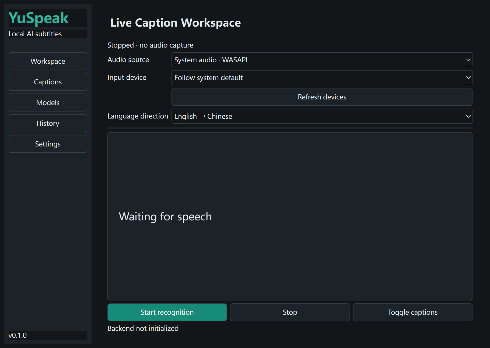

# YuSpeak
[简体中文](README.zh-CN.md)

[AI project handoff](PROJECT_HANDOFF.md)

Local AI live bilingual subtitles for Windows 10/11 x64. **Development preview,
not a fully accepted production release.** See PROJECT_STATUS.md and the handoff
before publishing. Repository: [HongyuLeo/YuSpeak](https://github.com/HongyuLeo/YuSpeak).
Core ASR inference, CUDA inference and the real bilingual caption chain have
**not been fully accepted**. Binary releases are deferred pending redistribution
compliance review; EXE GUI startup alone is not release approval.



## Implemented
- WASAPI system audio and microphone device selection, reconnect loop.
- 20 ms WebRTC VAD, streaming resampling, partial/final Whisper inference.
- Explicit CPU INT8 / CUDA FP16 selection; backend errors are surfaced.
- Offline Argos EN/ZH models using their CTranslate2 weights and tokenizers.
- Always-on-top transparent captions; global shortcuts and drag unlocking.
- Chinese/English UI, light/dark themes, tray, SQLite history and text editing.
- TXT, JSON, SRT and VTT export; optional, explicitly enabled audio recording.
- Model download with byte progress, cancellation, local import and provenance.

## Run
Use Python 3.12 on Windows x64:
```powershell
python -m venv .venv
.venv\Scripts\python -m pip install -r requirements.txt
.venv\Scripts\python -m yuspeak
```
For the portable application, extract the entire ZIP and launch YuSpeak.exe.
Models are **not bundled**. In Models, download/import an ASR model and install
both translation directions. Downloads are explicit network actions; inference
uses local files only. Select CPU first. CUDA requires compatible NVIDIA runtime
DLLs; see BUILD_AND_RELEASE.md. Detection of a GPU alone is not verification.

## Use
Select System audio to transcribe playback without a microphone. Select an input
device or follow the Windows default. Start captures audio; Pause suspends
recognition; Stop drains pending final segments. Use Ctrl+Alt+S for captions,
Ctrl+Alt+R for start/pause and Ctrl+Alt+L to unlock dragging. Shortcut conflicts
appear in the status bar. The main window may close to the tray.

History stores text locally; audio recording is off by default. Respect meeting
consent requirements and applicable recording rules. Diagnostics do not include
full transcript text. No telemetry or remote translation APIs are used.

## Limitations
Exclusive fullscreen games may hide desktop overlays; use borderless mode.
Whisper is quasi-streaming, not native streaming. Long utterances are capped at
5 s; partial windows are replaceable. Slow inference can drop old final windows;
time ranges are logged and drop counters are visible. Accuracy and 1–3 s latency
are not guaranteed. Real microphone speech, GPU inference, translation quality,
offline isolation and 10/30/60 minute soak tests require recorded acceptance.
Some requested management and appearance controls are not yet implemented.

## Development
```powershell
python -m pytest -q
.\build_windows.ps1
```
See CONTRIBUTING.md, docs/ARCHITECTURE.md, BUILD_AND_RELEASE.md and
CHATGPT_HANDOFF.md. MIT for project code; third-party licenses remain separate.

AI handoff uses the repository link and CHATGPT_HANDOFF.md (section K), not
manual uploads of the full project to ChatGPT. See PUBLICATION_STATUS.md for
actual publication status.
