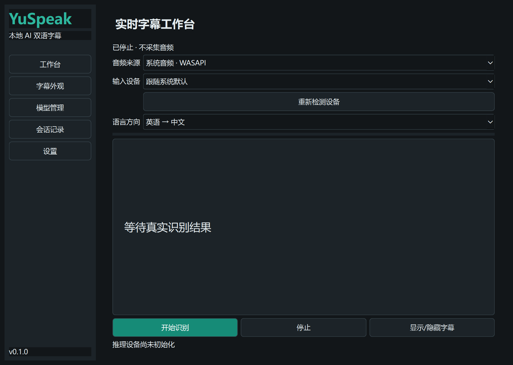

# YuSpeak
[English](README.md)

Windows 本地 AI 实时双语字幕助手。当前为开发预览版，**核心 ASR、CUDA 推理和真实双语字幕链路尚未全部验收，不应宣传为完整正式版**。

仓库：[HongyuLeo/YuSpeak](https://github.com/HongyuLeo/YuSpeak)。二进制 Release 暂缓：再分发合规审计尚未完成，EXE 能启动不等于发布检查通过。



## 当前功能
WASAPI 系统音频 / 麦克风选择、设备重连、20ms VAD、持续重采样、Whisper 临时与最终识别、Argos 本地双向翻译模型接口、独立识别与翻译线程、透明置顶字幕、全局快捷键、系统托盘、中英文界面、深浅主题、SQLite 会话编辑及 TXT/JSON/SRT/VTT 导出。

模型没有随安装包附带。首次运行进入模型管理，下载或导入 ASR 模型并安装英中两种翻译方向。只有模型下载显式联网；推理只读本地模型。

## 运行
解压完整便携包，运行 YuSpeak.exe。开发运行使用 Python 3.12：
```powershell
python -m venv .venv
.venv\Scripts\python -m pip install -r requirements.txt
.venv\Scripts\python -m yuspeak
```
优先使用 CPU 模式。CUDA 需要匹配的运行时 DLL，不能以检测到显卡代替实际 GPU 推理测试。

## 操作
选择系统音频即可采集视频声音，不需要麦克风。开始后显示明显监听状态。暂停停止识别，停止会处理剩余片段。Ctrl+Alt+S 显示/隐藏字幕；Ctrl+Alt+R 开始/暂停；Ctrl+Alt+L 解锁拖动。冲突会在状态栏显示。

默认保存文字，不保存音频。录音必须显式开启；涉及其他参与者时遵守会议规则与当地法律。运行日志不记录完整谈话正文。关闭主窗口可留在托盘，退出用托盘菜单。

## 限制
独占全屏游戏可能无法显示桌面字幕，请使用无边框模式。连续语音每 5 秒切段；Whisper 为应用层准实时。慢推理会跳过过时片段并记录范围与计数，不能保证零内容丢失。未测项目不代表通过，详见 TEST_REPORT.md、BENCHMARK_REPORT.md 与 PROJECT_STATUS.md。部分高级设置尚未实现。

## 发布准备
源码采用 MIT。第三方运行时和模型授权需单独核查。
交接改为仓库链接，不需要向 ChatGPT 上传全部源码与大文件。
交接入口：CHATGPT_HANDOFF.md 的 J/K 节；构建：BUILD_AND_RELEASE.md；实际上传状态：PUBLICATION_STATUS.md。
